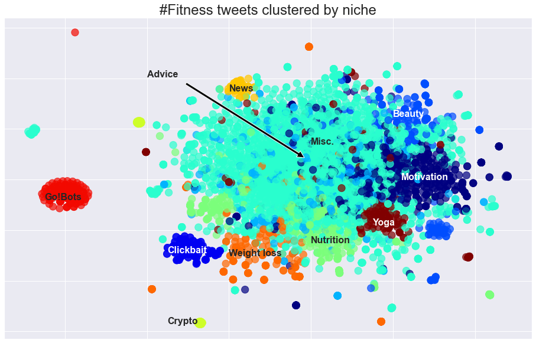

# Unsupervised Learning - Tweet Analysis 
See the full code [here](project3.ipynb)  
Presentation date: July 21, 2022  
Collaborators: [Agata Miler](https://github.com/agataMiler), [Shreyas Gowrishanker](https://github.com/g-shrey)

In this group project, we collected tweets with a specific hashtag (in this case, #fitness), processed them with NLP techniques, and used K-Means clustering to classify tweets into sub-groups. 

### Design
1. We used twitter's developer api in combination with a package called [tweepy](https://www.tweepy.org/) to collect tweets by hashtag. 
2. After collecting 5000 tweets, we used tools from [NLTK](https://www.nltk.org/) and TF-IDF vectorization to build a feature matrix of tweets.
3. Next, Principle Component Analysis (PCA) was applied reduce the number of features to 2500.
4. Using K-Means clustering, we plotted the within cluster sum of squares (WCSS) and silhouette scores for a range of clusters to determine the optimal number of clusters. 
5. We sampled each cluster randomly to identify what the clustering "means" i.e. what is the similarity within the cluster
6. Finally, we used [t-SNE](https://scikit-learn.org/stable/modules/generated/sklearn.manifold.TSNE.html) to embed the data in 2D and view the labelled clusters in the reduced space.

### Conclusions

t-SNE embedding with labelled clusters

We saw some pretty interesting results from the visualization! A large proportion of tweets we classified as 'miscellaneous' (no obvious identifiers) and 'advice', which was also pretty general, were grouped together in the centre of the graph. Then we see tight groupings of highly specific tweets (Go!Bots spam tweets, crypto/NFT-based tweets) separate from the bulk of fitness tweets. On the edge, we see clickbait (links to articles making fantastic or outrageous claims), and a sort of archipelago of weight loss, nutrition, yoga, beauty, and motivation tweets. Finally, a small but obvious cluster of news tweets exists. 
